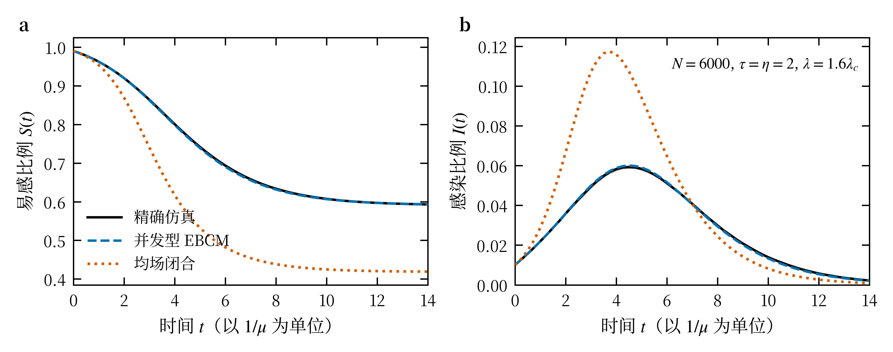

# 摘要

现实中的高阶交互往往是有向的：施加影响的一方与接受影响的一方并不对称。我们在有向超图上建立 SIR 模型并求解其简单传播分支。每条超边分为不相交的尾集与头集；尾集中被感染的成员数达到群体阈值 $\theta$ 时超边激活，以速率 $\beta$ 向头集中每个易感节点传递，感染者以速率 $\mu$ 康复，控制参数 $\lambda=\beta/\mu$。$\theta=1$ 时的技术困难在于一条超边只有一个激活时钟却由 $\tau$ 个尾成员共同驱动——激活时长是各成员感染期之并，闭合变量不能逐成员相乘。以尾集中易感、感染、康复的成员计数为状态，可把"尚未传递"写成一条以传递事件为消灭机制的 Markov 链，得到 $\binom{\tau+2}{2}+1$ 维、与系统规模无关的闭方程组，其解给出完整的含时演化；终态在 $\tau=1$ 时另有闭式，$\tau\ge2$ 时须由方程组积分。线性化给出爆发阈值 $\lambda_c=1/(\tau\kappa-1)$，其中 $\kappa=\langle k_{\rm in}k_{\rm out}\rangle/\langle k_{\rm out}\rangle$；$\tau=\eta=1$ 时它退化为有向随机图上 SIR 的已知结果。阈值经 $\kappa$ 依赖于入出度相关，却与超边重叠无关——后者是树状闭合的一条可证伪推论。与精确 Gillespie 仿真比较，闭合对 $S(t)$ 的偏差随系统规模趋零，而同一模型的度均场把阈值压低到 $0.75\lambda_c$，在真实的亚临界区就给出宏观爆发，其偏差收敛到非零平台；阈值本身由亚临界终态外推独立测得，与解析值相差 $1.4\sigma$。模型另给出两个与直觉相反的结构结论：均匀单种子下的平均爆发规模几乎不能探测方向对称性破缺，须改用爆发概率与条件爆发规模；方向翻转下的奇宇称是破缺的必要而远非充分条件。$\theta\ge2$ 时激活不再是单条超边的独立事件，模型转入 bootstrap 与 $k$-core 型渗流，另行处理。

# I. 引言

许多传染并非沿边逐个发生，而是在一个群体内集体发生 [1, 2]，这类高阶交互在真实数据中普遍存在 [3]。但群体交互往往是有向的：施加影响的一方与接受影响的一方并不对称。代谢反应把一组底物转化为一组产物 [4]，比特币交易与引用数据同样是一组主体指向另一组 [5]。有向超图正是为刻画这种不对称而设的形式化——每条超边分为施加影响的尾集与接受影响的头集（二者不相交），这一结构在算法与运筹领域已使用三十余年 [6]。

已有的理论工具恰好绕开了这个交叉点。成对网络上的 SIR 已由两条彼此独立的路径解决：渗流给出阈值与终态 [7, 8, 9]——临界占据概率为 $\langle k\rangle/(\langle k^2\rangle-\langle k\rangle)$，二阶矩发散时趋零，无标度网络上的 SIS 模型给出过同一结论 [10]；方程给出峰值与时间演化——Volz 的低维闭合 [11] 经 Miller 等整理为边基房室模型（EBCM），以"沿一条边尚未传来感染"的概率为核心变量 [12]；二者可相互印证 [13]。方向性作为成对网络的属性也已处理成熟：有向随机图各巨分支的规模由入出度联合分布决定 [14]，阈值与分支规模可解析求出 [15, 16]，且再生数经 $\langle k_{\rm in}k_{\rm out}\rangle$ 依赖于入出度的相关 [17]。高阶交互一侧同样成果丰富：单纯复形与超图上的传播可出现不连续相变与双稳 [18, 19, 20]，结构的影响也已刻画——链接度异质性抑制爆炸式相变 [21]，超核分解给出局域化的中心性 [22]，高阶连通分支的巨分支是单种子全局爆发的必要条件 [23]，最佳种子群体已被刻画 [24]，而超边重叠决定转变是否爆炸式且方向与直觉相反 [25, 26, 27]，超图渗流理论亦已建立 [28, 29]。两条线索各自成熟，却始终没有相交：处理方向性的工作都停留在成对网络，处理高阶交互的工作则都假设超边无向。

有向超图上，结构刻画的工具近年已迅速成型——真实数据的微观组织与高阶互惠性 [5, 30]、重叠测度 [31]、位形模型与保度随机化 [32, 33]、保入出度序列的均匀采样 [34, 35]。动力学一侧则少得多，据我们所知以 Li 等的工作为主：他们在有向超图上建立社会传播模型，发现双稳区间随有向强度减弱而收缩 [36]。该工作采用均场闭合，方向性由单一标量参数调节。均场忽略邻域相关，误差在阈值邻域最大；成对网络上正是 EBCM 补上了这一层 [11, 12]。因此，有向超图上的传播阈值如何依赖于结构，据我们所知尚无超出均场的含时理论，也无可供解析扫描的渗流理论。

本文建立并求解有向超图上的 SIR 模型。第 II 节定义模型：尾集中被感染的成员数达到群体阈值 $\theta$ 时超边激活，以速率 $\beta$ 向头集中每个易感节点传递，感染者以速率 $\mu$ 康复，控制参数为 $\lambda=\beta/\mu$；非指数康复期会显著改变成对网络的流行阈值 [37]，其推广见附录。第 III 节给出 $\theta=1$ 的并发型 EBCM 方程。技术困难在于一条超边只有一个激活时钟却由 $\tau$ 个尾成员共同驱动——激活时长是各成员感染期之并，因而闭合变量不能逐成员相乘。以尾集中易感、感染、康复的成员计数为状态，可把"尚未传递"写成一条以传递事件为消灭机制的 Markov 链——等价于给该链添一个"已传递"的吸收态——得到 $\binom{\tau+2}{2}+1$ 维、与系统规模无关的闭方程组。爆发条件由线性化给出，$\lambda_c=1/(\tau\kappa-1)$，$\kappa=\langle k_{\rm in}k_{\rm out}\rangle/\langle k_{\rm out}\rangle$；$\tau=\eta=1$ 时退化为有向随机图的已知阈值 [16, 17]。阈值经 $\kappa$ 依赖于入出度相关 $r_{io}$，却与超边重叠无关——这不是疏漏，而是树状闭合的一条可证伪推论。$r_{io}$ 的作用方向依传播机制而异，须分别对待：有向网络的阈值型级联中，正的入出度相关在较宽的平均入度范围内提高系统稳健性 [38]，与本文的 SIR 结果相反。原因在于阈值模型按活跃邻居的比例判定激活，高入度因而抬高激活门槛，而 SIR 中高入度只增加暴露。与精确 Gillespie 仿真 [39] 比较，闭合的偏差随系统规模趋零，均场的不然：它把阈值压低四分之一，在真实的亚临界区就给出宏观爆发。

第 IV 节转向渗流一侧，把成对网络上的 SIR–渗流映射及其半有向修正 [8, 40] 与有向渗流的生成函数机制 [14, 15] 推广到有向超图。两条路径互不依赖，因而可互为验证；我们进一步证明二者的自洽方程在 $\mu\to0$ 极限下同构。$\theta\ge2$ 时激活不再是单条超边的独立事件，模型转入 bootstrap 与 $k$-core 型渗流，其相变结构不同于普通渗流 [41, 42, 43]，亦在该节处理。

为使结构依赖可被受控地检验，第 II 节给出有向超边重叠的可计算定义：对每一对有序超边构造 $2\times2$ 列联矩阵，四个通道分别对应共享节点同为尾成员、同为头成员、或一为头一为尾。四通道之和精确等于无向重叠，因而结果可与无向文献直接对照 [25, 26]；互惠方向另采用文献中的强互惠判据 [5]。入出度相关 $r_{io}$ 与重叠 $\alpha$ 作用在生成流程的不同环节，因而可独立扫描；零模型基线取自已有的均匀采样器 [34, 35]。

方向对称性破缺的分析（第 II、VI 节）给出两个与直觉相反的结果。其一，均匀单种子下的平均爆发规模几乎不能用来探测破缺：可达有序对的总数在方向翻转下近乎守恒，翻转真正改变的是这些可达对如何分配——大爆发的概率由巨入分支决定、终态规模由巨出分支决定，而翻转恰好交换二者 [17, 40]。我们因而以爆发概率与条件爆发规模为序参量。其二，翻转奇是破缺的必要条件却远非充分：双度序列的不对称驱动的破缺是数十个标准差的效应，而同样翻转奇的重叠极性 $\Delta\alpha$ 效应始终不可分辨，我们只能给出上界。破缺因而由分支结构的不对称驱动，而非由重叠的极性驱动。

本文余下部分安排如下。第 II 节给出模型定义、有向超边重叠的可计算形式，以及结构量在方向翻转下的宇称分类。第 III 节推导并发型 EBCM 方程并给出仿真校验。第 IV 节建立渗流映射与生成函数阈值理论。第 V 节介绍保度生成与定向重连工具。第 VI 节给出阈值对结构参数的依赖、方向对称性破缺，以及两方法的交叉验证。第 VII 节在真实有向超图数据上检验模型。第 VIII 节为讨论与结论。

# II. 模型与结构量

## A. 有向超图与记号

有向超图 $\mathcal{H}=(V,E)$ 由节点集 $V$（$N=|V|$）与超边集 $E$（$M=|E|$）构成。$E$ 为集合，即不含重复超边；第 V 节的生成器在配对后显式修复重复超边与 $T\cap H$ 相交的违规。每条超边是一个有序对

$$
e=\bigl(T(e),\,H(e)\bigr),\qquad T(e),H(e)\subseteq V,\qquad T(e)\cap H(e)=\varnothing
$$

其中尾集 $T(e)$ 为施加影响的一方，头集 $H(e)$ 为接受影响的一方。二者不相交，这既排除了自作用，也是后文重叠退化关系 \eqref{eq:reduction} 成立的前提。

主线取同质阶数，即对所有 $e$ 有 $|T(e)|=\tau$、$|H(e)|=\eta$；异质阶数的推广见附录。$\tau=\eta=1$ 时 $\mathcal{H}$ 退化为普通有向图；取 $T(e)\cup H(e)$ 为超边的支撑集则退化为无向超图。

节点的出度与入度分别计其作为尾成员与头成员的次数，

$$
k_{\rm out}(v)=\bigl|\{e\in E: v\in T(e)\}\bigr|,\qquad
k_{\rm in}(v)=\bigl|\{e\in E: v\in H(e)\}\bigr|
$$

二者的联合分布记为 $P(k_{\rm in},k_{\rm out})$。逐边计数给出两条握手关系

$$
\sum_{v\in V}k_{\rm out}(v)=\tau M,\qquad \sum_{v\in V}k_{\rm in}(v)=\eta M\label{eq:handshake}
$$

因此 $\langle k_{\rm out}\rangle/\langle k_{\rm in}\rangle=\tau/\eta$：尾集与头集基数不等时，两个平均度必然不等。

本文所用的随机系综为有向超图位形模型：给定双度序列 $d=\{(k_{\rm in}(v),k_{\rm out}(v))\}_{v\in V}$ 与阶数 $(\tau,\eta)$，对全部尾槽与头槽做均匀随机配对，再修复违规超边；具体实现见第 V 节。

本文的第一个结构参数是入出度相关

$$
r_{io}=\frac{\langle k_{\rm in}k_{\rm out}\rangle-\langle k_{\rm in}\rangle\langle k_{\rm out}\rangle}{\sigma_{k_{\rm in}}\sigma_{k_{\rm out}}}\label{eq:rio}
$$

即 $(k_{\rm in},k_{\rm out})$ 在节点上的 Pearson 相关系数——刻画同一节点两个方向的度值关系，而非相连节点之间的度值相似性 [44]。

必须强调 $r_{io}$ 是双度序列 $d$ 的函数，与超边如何连接无关。因此它由系综的输入决定，一经给定即不再随超边的重排而改变：调节 $r_{io}$ 只能在构造 $d$ 的阶段进行，即在两条边际度序列固定的前提下重新配置 $k_{\rm in}$ 与 $k_{\rm out}$ 在节点上的配对。下一小节的重叠 $\alpha$ 恰好相反：它在 $d$ 固定之后，才由超边的重排调节。两个结构参数因而作用在生成流程的不同环节，互不干扰——这一分离正是第 V 节两套工具的分工依据。

## B. SIR 动力学

每个节点在任一时刻处于易感（S）、感染（I）、康复（R）三态之一。感染只沿尾→头方向传递：超边尾集中的感染成员驱动其头集中的易感节点，反向不发生传递。

记 $I(t)\subseteq V$ 为 $t$ 时刻的感染节点集，并令

$$
n_e(t)=\bigl|T(e)\cap I(t)\bigr|\label{eq:ne}
$$

为超边 $e$ 尾集中已感染的成员数。超边 $e$ 对其头集中每个尚处易感态的节点 $u\in H(e)$ 施加的感染率取

$$
\lambda_e(t)=\beta\,g\bigl(n_e(t)\bigr),\qquad g(0)=0
$$

其中 $\beta>0$ 为传播强度，$g$ 为感染核。本文主线取群体阈值核

$$
g(n)=\Theta(n-\theta)=\begin{cases}1,& n\ge\theta\\ 0,& n<\theta\end{cases}
$$

尾集感染成员数 $n_e\ge\theta$ 时超边处于激活态，以恒定率向头集传递；成员康复使 $n_e$ 回落到 $\theta$ 以下时超边失活。$\theta=1$ 对应简单传播，任一尾成员感染即足以激活超边；$\theta\ge2$ 则要求多个尾成员的联合状态，属于阈值型复杂传播 [45, 46]。两者的渗流对应物不同，将在第 IV 节分别处理。

阈值放在尾侧、且逐超边判定，是本文主线的机制选择。取线性核 $g(n)=n$ 可回收"每个感染尾成员独立传递"的情形；把阈值改放头侧、令头节点在跨超边累积的剂量超过阈值时被感染，则得到另一类机制，由附录的剂量核统一处理。

易感节点 $u$ 的总感染率是它所在全部头集的贡献之和，

$$
\Lambda_u(t)=\sum_{e:\,u\in H(e)}\lambda_e(t)\label{eq:rate}
$$

感染节点以恒定率 $\mu$ 独立康复，$I\to R$，康复后不再参与传递。以 $\mu$ 归一时间尺度后，过程只依赖比值

$$
\lambda\equiv\beta/\mu
$$

故给定感染核后，$\lambda$ 是唯一的连续动力学控制参数，爆发阈值指其临界值 $\lambda_c$；后文所称"阈值随结构参数变化"即指 $\lambda_c$ 对 $r_{io}$、$\alpha$ 等量的依赖。$\{S,I,R\}^{V}$ 上的演化因而是连续时间 Markov 过程，可用 Gillespie 算法精确抽样 [39]——这是第 III 节数值校验的基础。非指数康复期分布的推广见附录。

初始条件需随 $\theta$ 而变。$\theta=1$ 时取单个均匀随机选取的种子节点感染即可。$\theta\ge2$ 时单个种子无法激活任何超边——任一超边的感染尾成员数至多为 $1<\theta$——过程只以种子自身康复告终，爆发规模恒为 $1/N$；因此必须取一个规模不小于 $\theta$ 的种子集，我们取均匀随机的初始感染比例 $f$。这与 bootstrap 渗流以初始激活比例为控制参数的做法一致 [42]，$f$ 因而是 $\theta\ge2$ 分支的第二个控制参数。

有限系统几乎必然在有限时间内到达无感染者的吸收态。记该吸收态中康复节点的占比为爆发规模 $S$，记 $S[\mathcal{H}]$ 为给定 $\mathcal{H}$ 时 $S$ 对动力学随机性与种子选取的条件期望。两种初始条件下种子分布都均匀，因而与超边方向无关，这一点 II.D 将用到。

式 \eqref{eq:ne}–\eqref{eq:rate} 中方向性的作用是不对称的：节点的 $k_{\rm out}$ 决定它能把感染推给多少个头集，$k_{\rm in}$ 决定它暴露于多少个尾集。这一不对称正是 $r_{io}$ 得以进入动力学的通道。

## C. 有向超边重叠

第二个结构参数刻画超边之间如何共享节点。在无向超图中，两条超边的重叠只有"共享几个节点"一个自由度 [25, 26]；引入尾/头之分后，共享节点在两条超边中各自扮演的角色也成为信息。

对任意有序超边对 $(e,f)$，$e\neq f$，定义重叠列联矩阵的四个分量

$$
N_{ab}(e,f)=\bigl|A(e)\cap B(f)\bigr|,\qquad a,b\in\{T,H\}
$$

其中 $A=T$ 当 $a=T$、$A=H$ 当 $a=H$，$B$ 同理。四个通道各有独立的动力学含义：$N_{TT}$ 为共发，共享节点在两条超边中同为尾成员，同一感染源向两个不同头集扇出；$N_{HH}$ 为共收，共享节点同为头成员，两条超边的感染率按 \eqref{eq:rate} 在该节点上叠加（附录的头侧剂量核下，跨超边剂量亦在此累积）；$N_{HT}$ 为串联，$e$ 的头集落入 $f$ 的尾集，构成 $e\to f$ 的传播链；$N_{TH}$ 为反向串联。由 $T(e)\cap H(e)=\varnothing$，令 $\bar e=T(e)\cup H(e)$ 即得

$$
\bigl|\bar e\cap\bar f\bigr|=N_{TT}+N_{TH}+N_{HT}+N_{HH}\label{eq:reduction}
$$

也就是说，对任意一对超边，四通道之和精确等于其无向重叠：本节的重叠量是现行定义的方向细化，因而后文结果可与无向文献直接对照。

归一化到 $[0,1]$ 取（同质阶数下分母逐通道为常数：$TT$ 取 $\tau$、$HH$ 取 $\eta$、两个串联通道取 $\min(\tau,\eta)$）

$$
n_{ab}(e,f)=\frac{N_{ab}(e,f)}{\min\bigl(|A(e)|,|B(f)|\bigr)}\label{eq:norm}
$$

聚合方式受一条硬约束限制。对固定的 $e$ 逐节点计数可得四条求和规则，例如

$$
\sum_{f\neq e}N_{TT}(e,f)=\sum_{v\in T(e)}\bigl(k_{\rm out}(v)-1\bigr),\qquad
\sum_{f\neq e}N_{HT}(e,f)=\sum_{v\in H(e)}k_{\rm out}(v)
$$

其余两式同理。右端只依赖度序列，因此在保度约束下四个通道的重叠总量是常数；同质阶数下 \eqref{eq:norm} 的分母逐通道为常数，故无条件平均 $\langle n_{ab}\rangle$ 同样被度序列锁死，无法作为可调参数。可变的是重叠的堆积方式——是让少数超边对深度共享，还是让共享摊薄到大量超边对上。据此定义条件平均

$$
\alpha^{ab}_{\sigma\sigma'}=\Bigl\langle\, n_{ab}(e,f)\ \Bigm|\ N_{ab}(e,f)\ge1,\ \sigma(e)=\sigma,\ \sigma(f)=\sigma' \,\Bigr\rangle\label{eq:alpha}
$$

即在确实发生重叠的超边对上取平均，其中 $\sigma(e)=(|T(e)|,|H(e)|)$ 为超边的阶；该通道无重叠时 $\alpha^{ab}$ 不定义。记 $m_{ab}$ 为该通道中发生重叠的超边对数，则 $\alpha^{ab}=C_{ab}/m_{ab}$，常数 $C_{ab}$ 仅由度序列决定。因此调节 $\alpha$ 等价于调节 $m_{ab}$，这决定了第 V 节重连算法的实现方式。

式 \eqref{eq:alpha} 中阶指标取对角块（$\sigma=\sigma'$）即阶内重叠、取非对角块即阶间重叠，与无向情形下超边重叠矩阵的对角/非对角划分一致 [26]；本文只是在其每个矩阵元上再展开出四个方向通道。同质阶数下阶指标退化，以下略去并简记为 $\alpha^{ab}$；第 VII 节的真实数据阶数异质，届时阶指标重新生效。

互惠方向不由上述张量刻画。两条超边是否互相指回，取决于一组超边能否共同完成反向覆盖，这是超边级而非超边对级的判据。本文直接采用已有的强互惠定义 [5]：若存在一组超边，其尾集之并覆盖 $H(e)$ 且头集之并覆盖 $T(e)$，则称 $e$ 被强互惠；取

$$
\alpha^{\rightleftarrows}=\frac{\bigl|\{e\in E:\ e\ \text{被强互惠}\}\bigr|}{M}
$$

采用这一定义是为了与已有测量口径一致，便于第 VII 节与真实数据的报告值并列。需要注意它与 $\alpha^{ab}$ 不同类：退化关系 \eqref{eq:reduction} 对它不成立，它也不进入第 IV 节转移算子的权重。

## D. 方向翻转与宇称

定义全局方向翻转 $\mathcal{R}$ 为对所有超边交换尾集与头集，

$$
\mathcal{R}:\ e=\bigl(T(e),H(e)\bigr)\ \longmapsto\ \bigl(H(e),T(e)\bigr)
$$

$\mathcal{R}$ 是有向超图空间上的对合（$\mathcal{R}^2=\mathrm{id}$）。它把每个节点的入度与出度互换，把 $\tau$ 与 $\eta$ 互换，并在四个重叠通道上作用为

$$
\mathcal{R}:\quad \alpha^{TT}\leftrightarrow\alpha^{HH},\qquad \alpha^{HT}\leftrightarrow\alpha^{TH}
$$

两个串联通道并不独立。对有序超边对恒有 $N_{TH}(e,f)=N_{HT}(f,e)$，故同质阶数下 $\alpha^{HT}$ 与 $\alpha^{TH}$ 逐实现相等（异质阶数下互为阶指标的转置），串联方向只携带一个分量，记 $\alpha^{\rightrightarrows}=\alpha^{HT}$。四个通道在聚合层面因而只有三个独立分量。

按宇称重组：$\alpha^{\rightrightarrows}$ 与并联重叠 $\alpha^{\parallel}=\tfrac12(\alpha^{TT}+\alpha^{HH})$ 在 $\mathcal{R}$ 下为偶，而极性失衡

$$
\Delta\alpha=\tfrac12\bigl(\alpha^{TT}-\alpha^{HH}\bigr)
$$

为奇。跨结构比较（如阈值对 $\alpha^{\rightrightarrows}$ 的依赖）必须固定 $\alpha^{\parallel}$，否则三个分量的效应混在同一条扫描线上；但成对的 $\mathcal{H}$–$\mathcal{R}\mathcal{H}$ 比较不受此限，因为 $\alpha^{\parallel}$ 为偶，翻转前后取值相同，无法伪造配对差异。

入出度相关 $r_{io}$ 在 $\mathcal{R}$ 下为偶：翻转互换每个节点的 $(k_{\rm in},k_{\rm out})$，而 \eqref{eq:rio} 的 Pearson 相关系数对其两个变量对称，故 $r_{io}(\mathcal{R}\mathcal{H})=r_{io}(\mathcal{H})$。

据此可把结构量按宇称分类。本文所用结构量中，$\mathcal{R}$-奇的来源有两个且相互独立：双度序列 $d$ 关于分量互换的不对称性，以及极性失衡 $\Delta\alpha$。尾头基数之差 $\tau-\eta$ 不是第三个独立来源——由 \eqref{eq:handshake}，$d$ 互换对称蕴含 $\tau=\eta$，故 $\tau\neq\eta$ 只是序列不对称的一个充分标志；反之序列不对称时 $\tau=\eta$ 仍可成立。

这一分类对终态有直接约束。设结构系综 $\mathbb{P}[\mathcal{H}]$ 生成随机有向超图，$S[\mathcal{H}]$ 为 II.B 定义的条件期望爆发规模；由于种子均匀选取，$S$ 的定义本身不引入方向偏好。

> **命题 1.** 若 $\mathbb{P}$ 在 $\mathcal{R}$ 下不变，即 $\mathbb{P}[\mathcal{R}\mathcal{H}]=\mathbb{P}[\mathcal{H}]$ 对所有 $\mathcal{H}$ 成立，则 $\langle S\rangle_{\mathbb{P}}=\langle S\circ\mathcal{R}\rangle_{\mathbb{P}}$。

证明只需一次换元：$\mathcal{R}$ 是结构空间上的可测对合，故 $\sum_{\mathcal{H}}\mathbb{P}[\mathcal{H}]\,S[\mathcal{R}\mathcal{H}]=\sum_{\mathcal{H}}\mathbb{P}[\mathcal{R}\mathcal{H}]\,S[\mathcal{H}]=\sum_{\mathcal{H}}\mathbb{P}[\mathcal{H}]\,S[\mathcal{H}]$。

命题 1 的逆否形式给出方向对称性破缺的必要条件：系综层面的破缺要求生成系综本身破坏 $\mathcal{R}$-不变性。在本文所用结构量中，能承载这一破坏的只有上述两个 $\mathcal{R}$-奇的来源。

但即便必要条件被满足，破缺也未必能在 $\langle S\rangle$ 上看到。存在一条更强的不变性，它与系综是否 $\mathcal{R}$-不变无关：

> **命题 2.** 设 (i) 终态可表示为某个随机结构 $\mathcal{G}(\mathcal{H})$ 上的可达性，即从种子 $v$ 出发的最终感染集为 $v$ 在 $\mathcal{G}$ 中的出分支 $\mathrm{out}(v)$，如 [40] 的半有向流行渗流网络所给出；且 (ii) $\mathcal{G}(\mathcal{R}\mathcal{H})$ 与 $\mathcal{G}(\mathcal{H})$ 的转置同分布。则对任意有向超图 $\mathcal{H}$，均匀单种子下的平均爆发规模在方向翻转下不变。

证明只需一次计数：$\sum_v|\mathrm{out}(v)|=\#\{(v,u):u\ \text{自}\ v\ \text{可达}\}=\sum_v|\mathrm{in}(v)|$。转置把每个可达有序对 $(v,u)$ 换成 $(u,v)$，可达对的总数因而逐实现不变；除以 $N^2$ 即得 $\langle S\rangle$ 不变。

假设 (ii) 需要分情形讨论。取线性核 $g(n)=n$ 时，传播事件对每个（尾成员，头成员）对独立发生，$\mathcal{G}$ 可在不参照种子的情况下一次抽出，(ii) 严格成立，计数恒等式因而逐实现精确。但本文主线的超边级阈值核不满足 (ii)：超边的激活区间是其已感染尾成员感染期的并集，取决于哪些尾成员先被感染，因而依赖种子，$\mathcal{G}$ 不是种子无关的。

这一违背是真实的，不能当作可忽略的小量。第 VI 节在 $\tau=3,\eta=1$ 的最不对称构型上测得 $\langle S\rangle$ 的翻转残余约为 $-2\%$（阈值邻域，四个独立结构符号一致，合并 $5\sigma$）。它并非仿真器对 $\mathcal{H}$ 与 $\mathcal{R}\mathcal{H}$ 处理不均所致。在互换对称的双度序列上，命题 1 直接禁止破缺，而同一协议只给出 $-0.36\%\pm0.28\%$，与零相容；即便保守地把这一数值当作仪器基线扣除，剩余部分仍有 $-1.88\%\pm0.52\%$（$3.6\sigma$）。该效应为超边级激活所特有，成对情形与线性核下均不出现。因此命题 2 对本文主线只是近似结论，$\langle S\rangle$ 并非严格不变量。

即便如此，命题 2 的结论在量级上仍然成立：$\langle S\rangle$ 是一个极差的破缺序参量。同一批构型上 $\Pi$ 在翻转下由 $0.67$ 变为 $0.39$，相对其均值的差异约 $53\%$，比 $\langle S\rangle$ 的 $2\%$ 残余大二十余倍。破缺出现在可达对如何分布，而非其总数。按 [40]，大爆发的概率由巨入分支的相对规模决定，而爆发的终态规模由巨出分支决定；$\mathcal{R}$ 恰好交换这两者。成对有向图上这一分离已有明确表述：爆发概率由沿出边的前向分支过程给出，爆发规模由沿入边的后向分支过程给出，后者等价于时间反演模型中的前向计算 [17]。本文的命题 2 正是该结构在有向超图上的推论。因此本文取

$$
\Pi=\Pr\bigl(S>S_{\rm cut}\bigr),\qquad \bar S=\mathbb{E}\bigl[S\mid S>S_{\rm cut}\bigr]
$$

为破缺的序参量，其中 $S_{\rm cut}$ 为区分自限爆发与大爆发的阈值。由全期望公式

$$
\langle S\rangle=\Pi\,\bar S+(1-\Pi)\,s_{<},\qquad s_{<}=\mathbb{E}\bigl[S\mid S\le S_{\rm cut}\bigr]
$$

而命题 2 把左端近似钉住，故右端各项的 $\mathcal{R}$-奇部分须相互抵消至上述 $2\%$ 的残余以内。这是一条可证伪的预言，第 VI 节将检验之——检验时须把残余本身作为已知的系统项扣除，而非视作零。注意 $s_{<}$ 在阈值邻域并不可忽略：那里绝大多数实现是自限的（$1-\Pi$ 接近 1），预跑测得自限项 $(1-\Pi)s_{<}$ 在 $\lambda=\lambda_c$ 处占 $\langle S\rangle$ 的 $47\%$。因此补偿关系须按上式逐项核算，不能简化为 $\langle S\rangle\approx\Pi\bar S$。

$r_{io}$ 的角色由此成为一个可直接检验的推论：它不能单独产生破缺。设双度序列 $d$ 关于分量互换对称，即 $\mathcal{R}d$ 与 $d$ 至多相差一个节点重标号。$\mathcal{R}$ 把位形模型系综 $\mathrm{CM}(d)$ 映为 $\mathrm{CM}(\mathcal{R}d)$，后者是前者在该重标号下的像；而 $S$ 与节点标号无关，故命题 1 的结论成立。关键在于这类对称序列可以取遍 $r_{io}\in[-1,1]$ 的整个范围（例如 $d$ 由若干对 $(a,b)$ 与 $(b,a)$ 组成时序列对称而 $r_{io}$ 可为任意值），因此沿 $r_{io}$ 扫描的整条线上都不应出现破缺，尽管 $r_{io}$ 确实移动阈值。

最后需要强调，$\mathcal{R}$-奇是必要条件，却远非充分条件。宇称分类指出哪些量可能驱动破缺，不指出哪一个实际驱动——后者是动力学问题，分类本身无从回答。第 VI 节的结论是两个 $\mathcal{R}$-奇来源分野明显：分支结构的不对称（阶数与双度序列）驱动的破缺在 $\Pi$ 上是显著效应，而重叠极性 $\Delta\alpha$ 尽管同为 $\mathcal{R}$-奇，其效应随 $\Delta\alpha$ 增大始终不可分辨，只能给出上界。

据此，第 VI 节破缺实验的设计为：全部测量以 $(\Pi,\bar S)$ 为序参量而非 $\langle S\rangle$；主实验驱动分支结构的不对称，$\Delta\alpha$ 的效应作为独立扫描给出上界；$r_{io}$ 扫描作为阴性对照；$\langle S\rangle$ 的近似不变性作为内部一致性检查，其 $2\%$ 残余须与 $\Pi$ 的破缺幅度并列报告，以显示二者相差一个多数量级。

两条命题的适用层级不同：命题 1 是关于结构系综的陈述，命题 2 则对每个 $\mathcal{H}$ 单独成立——这正是它可以在单个不对称结构上被检验的原因。但两者针对的都是已对动力学随机性与种子取过平均的 $S[\mathcal{H}]$；单次仿真的爆发规模在 $\mathcal{H}$ 与 $\mathcal{R}\mathcal{H}$ 之间自然不等，其差是有限次抽样的涨落，随实现数增大而趋零。

# III. 并发型边基房室方程

## A. 空腔构造与闭合假设

成对网络上的边基房室模型（EBCM）以"沿一条边尚未传来感染"的概率为核心变量，把 SIR 的含时演化压缩到少数常微分方程 [11, 12]。移到有向超图上有两重并发需要处理：一个头节点同时暴露于 $k_{\rm in}$ 条超边，而每条超边内又有 $\tau$ 个尾成员同时向它施压。前一重可以因子化，后一重不能——本小节说明界线在哪里。

固定一个检验节点 $u$，人为令其永久保持易感（空腔节点），并取一条以 $u$ 为头成员的超边 $e$，即 $u\in H(e)$。定义边基变量

$$
\Phi(t)=\Pr\bigl[e\ \text{到}\ t\ \text{时刻尚未向}\ u\ \text{传递感染}\bigr]\label{eq:phi}
$$

由 II.B 的速率规则，$e$ 在时刻 $s$ 以速率 $\beta g(n_e(s))$ 向 $u$ 施压，故

$$
\Phi(t)=\Bigl\langle\exp\Bigl[-\beta\int_0^{t}g\bigl(n_e(s)\bigr)\,\mathrm{d}s\Bigr]\Bigr\rangle\label{eq:phiexp}
$$

主线取 $\theta=1$，此时 $g(n_e)=\mathbb{1}[n_e\ge1]$，指数上的积分即 $e$ 的激活时长，也就是其各尾成员感染期之并的测度。并的测度不等于各成员贡献之和，因而

$$
\Phi(t)\neq\prod_{v\in T(e)}\Phi_v(t)\label{eq:noprod}
$$

朴素的逐成员乘积闭合在此失效。这与 II.D 中破坏命题 2 假设 (ii) 的是同一件事——超边级激活：一条超边只有一个激活时钟，它由全体尾成员共同驱动，又被全体头成员共享。

闭合建立在两条假设上。

**(H1) 局域树状。** 位形模型系综在 $N\to\infty$ 时局域收敛于树，任一有限邻域内出现回路的概率为 $O(1/N)$。据此 $u$ 的 $k_{\rm in}$ 条入超边的上游分支互不相交，第一重并发因子化：

$$
S(t)=(1-\varepsilon)\,\psi_{\rm in}\bigl(\Phi(t)\bigr),\qquad
\psi_{\rm in}(x)=\sum_{k}P(k_{\rm in}=k)\,x^{k}\label{eq:S}
$$

其中 $\varepsilon$ 为初始均匀感染比例。

**(H2) 尾内无相互作用。** 由 $T(e)\cap H(e)=\varnothing$，超边 $e$ 不在其尾成员之间传递感染；结合 (H1)，$T(e)$ 的 $\tau$ 个成员处在互不相交的上游分支，其感染时刻因而相互独立。

(H2) 是有向结构特有的。无向超图中同一条超边内的节点相互施加影响，"尾成员相互独立"根本无从谈起；正是尾与头的分离，使第二重并发退化为"$\tau$ 个独立个体驱动同一个共享时钟"，从而可由一个低维状态刻画。

还需注意一处度偏置。沿 $e$ 的一个尾槽到达的节点 $v$ 是按 $k_{\rm out}$ 加权抽取的，而决定 $v$ 何时被感染的是它的 $k_{\rm in}$ 条入超边。由 $T\cap H=\varnothing$，$e$ 本身不属于 $v$ 的入超边，因而不出现无向 EBCM 中的余度相减——偏置变量与计数变量是两个不同的量。据此定义尾侧生成函数

$$
\psi_{\rm tail}(x)=\frac{1}{\langle k_{\rm out}\rangle}\sum_{k_{\rm in},k_{\rm out}}k_{\rm out}\,P(k_{\rm in},k_{\rm out})\,x^{k_{\rm in}}\label{eq:psitail}
$$

$\psi_{\rm tail}$ 显式依赖于联合分布 $P(k_{\rm in},k_{\rm out})$，而 \eqref{eq:S} 的 $\psi_{\rm in}$ 只依赖于其边际。这是 II.A 的入出度相关 $r_{io}$ 进入动力学的解析通道，也是下文阈值公式中唯一承载 $r_{io}$ 的位置。

## B. 方程组

由 (H2)，$e$ 的 $\tau$ 个尾成员相互独立，其联合状态可由计数 $(a,b,c)$ 概括：$a$ 个易感、$b$ 个感染、$c$ 个康复，$a+b+c=\tau$。定义未传递子概率

$$
x_{abc}(t)=\Pr\bigl[e\ \text{尚未向}\ u\ \text{传递}\ \ \wedge\ \ T(e)\ \text{处于状态}\ (a,b,c)\bigr]\label{eq:xabc}
$$

于是 $\Phi=\sum_{a+b+c=\tau}x_{abc}$，而

$$
\Phi_A(t)=\sum_{b\ge\theta}x_{abc}(t)\label{eq:phiA}
$$

为"$e$ 处于激活态且尚未传递"的概率。

尾成员的感染是一个时间非齐次的 Markov 过程。由 \eqref{eq:S} 与 \eqref{eq:psitail}，一个尾成员到 $t$ 时刻仍易感的概率为 $(1-\varepsilon)\psi_{\rm tail}(\Phi(t))$，其瞬时风险率因而是

$$
h(t)=-\frac{\mathrm{d}}{\mathrm{d}t}\ln\bigl[(1-\varepsilon)\psi_{\rm tail}(\Phi)\bigr]
=\beta\,\Phi_A\,\frac{\psi'_{\rm tail}(\Phi)}{\psi_{\rm tail}(\Phi)}\label{eq:h}
$$

末一步用了下面的 \eqref{eq:phidot}。向 $u$ 的传递以速率 $\beta\,\mathbb{1}[b\ge\theta]$ 把概率移出"未传递"类。等价地，在 $(a,b,c)$ 之外添一个"已传递"的吸收态，则整体是一条标准的连续时间 Markov 链，而 $x_{abc}$ 是其未被吸收部分的子概率，$\sum_{abc}x_{abc}=\Phi\le1$；概率论中这称为以速率 $\beta\,\mathbb{1}[b\ge\theta]$ 消灭（killing）的 Markov 链，其半群为次随机的，而 \eqref{eq:phiexp} 正是它的 Feynman–Kac 表示。据此

$$
\dot x_{abc}=h\bigl[(a+1)x_{a+1,b-1,c}-a\,x_{abc}\bigr]
+\mu\bigl[(b+1)x_{a,b+1,c-1}-b\,x_{abc}\bigr]
-\beta\,\mathbb{1}[b\ge\theta]\,x_{abc}\label{eq:master}
$$

（越界下标记为零）。对 \eqref{eq:master} 求和，$h$ 项与 $\mu$ 项各自守恒而相消，只余

$$
\dot\Phi=-\beta\,\Phi_A\label{eq:phidot}
$$

与 \eqref{eq:h} 自洽。终态由 $\dot R=\mu I$、$I=1-S-R$ 与 \eqref{eq:S} 闭合。初始条件为 $x_{a,\tau-a,0}(0)=\binom{\tau}{a}(1-\varepsilon)^{a}\varepsilon^{\tau-a}$，其余为零。

方程 \eqref{eq:S} 与 \eqref{eq:master}–\eqref{eq:phidot} 构成一个 $\binom{\tau+2}{2}+1$ 维闭系统：$\tau=2$ 时 7 个方程，$\tau=3$ 时 11 个，维数与系统规模 $N$ 无关。

**$\tau=1$ 的退化。** 此时只有三个变量，\eqref{eq:master} 化为

$$
\dot x_{100}=-h\,x_{100},\qquad
\dot x_{010}=h\,x_{100}-(\mu+\beta)\,x_{010},\qquad
\dot x_{001}=\mu\,x_{010}\label{eq:tau1}
$$

这正是成对 EBCM 的三元组 $(\Phi_S,\Phi_I,\Phi_R)$ [12]——依次为伙伴处于易感、已感染但尚未传递、已康复且未曾传递的概率——唯一的实质替换是把余度生成函数换成 \eqref{eq:psitail} 的 $\psi_{\rm tail}$。需注意记号差异：本文的 $\Phi$ 对应该文中三者之和 $\Theta$，而本文的 $x_{abc}$ 对应其 $\Phi$ 分量。

**$\tau=2$ 的显式形式。** 六个状态按 $(a,b,c)$ 记为 $x_{200},x_{110},x_{101},x_{020},x_{011},x_{002}$，\eqref{eq:master} 展开为

$$
\dot x_{200}=-2h\,x_{200},\qquad
\dot x_{110}=2h\,x_{200}-(h+\mu+\beta)\,x_{110},\qquad
\dot x_{101}=\mu\,x_{110}-h\,x_{101}\label{eq:tau2a}
$$

$$
\dot x_{020}=h\,x_{110}-(2\mu+\beta)\,x_{020},\qquad
\dot x_{011}=h\,x_{101}+2\mu\,x_{020}-(\mu+\beta)\,x_{011},\qquad
\dot x_{002}=\mu\,x_{011}\label{eq:tau2b}
$$

前三式对应尾集中至多一个成员曾被感染的情形，后三式对应两个成员；$\Phi_A=x_{110}+x_{020}+x_{011}$。逐式相加，$h$ 项与 $\mu$ 项成对相消，只余 $-\beta\Phi_A$，即 \eqref{eq:phidot}。手写的这六个方程与按 \eqref{eq:master} 自动生成的方程组，其积分在 $t=14$ 处相差 $6\times10^{-17}$。

**一条精确恒等式。** 全部尾成员易感蕴含 $e$ 从未激活，因而必未传递，故

$$
x_{\tau00}(t)=\bigl[(1-\varepsilon)\,\psi_{\rm tail}(\Phi(t))\bigr]^{\tau}\label{eq:identity}
$$

对一切 $t$ 成立。\eqref{eq:identity} 不是额外假设，而是 \eqref{eq:master} 的推论：对右端求导得 $-\tau h\,x_{\tau00}$，与 \eqref{eq:master} 在 $(a,b,c)=(\tau,0,0)$ 处逐项相同。它为数值积分提供了一条无需仿真的自检。

**求解到什么程度。** 有必要把"求解"的含义说清楚。$\theta=1$ 时，\eqref{eq:S} 与 \eqref{eq:master}–\eqref{eq:phidot} 构成一个封闭的低维系统，其积分给出完整的 $S(t)$、$I(t)$、$R(t)$ 与终态规模，精度由 III.E 逐项校验；爆发阈值 \eqref{eq:lc} 是闭式，$\tau=1$ 时终态亦有闭式 \eqref{eq:finalsize}。但 $\tau\ge2$ 时终态没有闭式，原因是结构性的而非技术性的：$\Phi_\infty$ 取决于各尾成员感染期之并的长度；$\tau=1$ 时这个并只有一段，其长度服从 $\mathrm{Exp}(\mu)$ 且与起始时刻无关，故可只用终态量闭合，而 $\tau\ge2$ 时并的长度依赖于各感染时刻的相对先后，终态量不足以确定它。这与 \eqref{eq:noprod} 是同一个障碍。取线性核 $g(n)=n$ 时传播事件逐（尾成员，头成员）对独立，闭式重新出现。$\theta\ge2$ 的爆发条件不属本节范围。

**$\theta\ge2$。** \eqref{eq:master} 中只有消灭项的指示函数依赖于 $\theta$，故方程组对任意 $\theta$ 形式不变。但下一小节的阈值分析不再适用：$\theta\ge2$ 时单个感染尾成员不足以激活超边，\eqref{eq:master} 在无病定态附近的线性化没有增长模式，这与 II.B 所述 bootstrap 图像一致，须按第 IV 节的 $k$-core 途径处理。

## C. 爆发阈值

令

$$
\kappa\equiv\psi'_{\rm tail}(1)=\frac{\langle k_{\rm in}k_{\rm out}\rangle}{\langle k_{\rm out}\rangle}\label{eq:kappa}
$$

$\varepsilon\to0$ 时无病定态为 $x_{\tau00}=1$、其余为零、$\Phi=1$。一阶量是恰有一个尾成员曾被感染的两个态，$p\equiv x_{\tau-1,1,0}$ 与 $q\equiv x_{\tau-1,0,1}$；判据是曾被感染的成员数 $b+c$，$b+c\ge2$ 的态为二阶——注意 $x_{\tau-2,1,1}$ 虽然 $b=1$ 也在其中。由两个种子规模积分读出各态随 $\varepsilon$ 的幂次，测得阶数逐态等于 $b+c$（$\tau=3$，见 `tools/check_order_counting.py`）。$\Phi_A$ 的一阶部分因而只有 $p$。由 \eqref{eq:h} 有 $h\simeq\beta\kappa p$，代入 \eqref{eq:master} 得

$$
\dot p=\bigl[\tau\beta\kappa-(\mu+\beta)\bigr]\,p\label{eq:linear}
$$

$q$ 不反馈到 $p$，故阈值由 $\tau\beta\kappa=\mu+\beta$ 单独给出。以 $\lambda=\beta/\mu$ 表示，

$$
\lambda_c=\frac{1}{\tau\kappa-1},\qquad \tau\kappa>1\label{eq:lc}
$$

$\tau\kappa\le1$ 时不存在有限阈值。

**分支解释自洽。** 一个感染的尾成员使其超边激活，超边在该成员的感染期内以速率 $\beta$ 向每个头成员施压，故对给定头成员的传递概率为 $T=\beta/(\beta+\mu)$。从尾侧计数得 $R_0=\tau\kappa T$；从头侧计数，新感染节点沿入边到达、其出度因而按 $k_{\rm in}$ 偏置，得 $R_0=\eta T\langle k_{\rm in}k_{\rm out}\rangle/\langle k_{\rm in}\rangle$——成对情形下 $\langle k_{\rm in}k_{\rm out}\rangle/\langle k_{\rm in}\rangle$ 正是有向图中"后继节点的平均出度"，亦即其再生数 [17]。由握手关系 \eqref{eq:handshake} 有 $\langle k_{\rm out}\rangle/\langle k_{\rm in}\rangle=\tau/\eta$，两式因而恒等：

$$
\tau\,\frac{\langle k_{\rm in}k_{\rm out}\rangle}{\langle k_{\rm out}\rangle}
=\eta\,\frac{\langle k_{\rm in}k_{\rm out}\rangle}{\langle k_{\rm in}\rangle}\label{eq:twocounts}
$$

两种数法给出同一个 $R_0$，且 $R_0=1$ 与 \eqref{eq:lc} 等价。

**$\tau=\eta=1$ 的退化。** \eqref{eq:lc} 化为 $\lambda_c=\bigl[\langle k_{\rm in}k_{\rm out}\rangle/\langle k_{\rm out}\rangle-1\bigr]^{-1}$，即有向随机图上 SIR 的已知阈值 [15, 16, 17]。[16] 的半有向阈值条件在纯有向极限下化为临界传播率 $T_c=\langle k_{\rm in}\rangle/\langle k_{\rm in}k_{\rm out}\rangle$，[17] 亦以再生数 $R_0=\langle k_{\rm in}k_{\rm out}\rangle/\langle k_{\rm in}\rangle$ 给出同一结果；由 $T=\lambda/(1+\lambda)$ 代入 \eqref{eq:lc} 得 $T_c=1/\kappa=\langle k_{\rm out}\rangle/\langle k_{\rm in}k_{\rm out}\rangle$，而 $\tau=\eta$ 时握手关系 \eqref{eq:handshake} 给出 $\langle k_{\rm in}\rangle=\langle k_{\rm out}\rangle$，两式因而恒等。需要强调，令 $k_{\rm in}=k_{\rm out}$ 并不回到无向网络的结果：无向情形的余度相减源于"来路那条边不可再用"，而有向情形下来路超边根本不在 $v$ 的入超边之列。\eqref{eq:lc} 分母中的 $-1$ 来自 $T=\beta/(\beta+\mu)$ 里的 $\beta$，与余度无关。两者是不同的结构，不应混为一谈。

**阈值对 $r_{io}$ 的依赖。** 由 $\langle k_{\rm in}k_{\rm out}\rangle=\langle k_{\rm in}\rangle\langle k_{\rm out}\rangle+r_{io}\sigma_{k_{\rm in}}\sigma_{k_{\rm out}}$ 与握手关系 \eqref{eq:handshake}，

$$
\tau\kappa=\tau\langle k_{\rm in}\rangle+\frac{N}{M}\,r_{io}\,\sigma_{k_{\rm in}}\sigma_{k_{\rm out}}\label{eq:taukappa}
$$

于是

$$
\lambda_c=\Bigl[\tau\langle k_{\rm in}\rangle+\tfrac{N}{M}\,r_{io}\,\sigma_{k_{\rm in}}\sigma_{k_{\rm out}}-1\Bigr]^{-1}\label{eq:lcrio}
$$

在两条边际度序列固定时 $\lambda_c$ 是 $r_{io}$ 的严格减函数：正的入出度相关促进传播。这一方向与成对有向图上的 SIR 一致——那里 $R_0$ 同样经 $\langle k_{\rm in}k_{\rm out}\rangle$ 依赖于入出度的协方差 [17]；\eqref{eq:lcrio} 把该依赖推广到有向超图，并显式给出 $\tau$ 与 $N/M$ 的系数。需要提醒的是这一方向并非普适于一切传播机制：有向网络的阈值型级联中，正的入出度相关反而提高系统稳健性 [38]。二者并不冲突——阈值模型按活跃邻居的比例判定激活，高入度抬高激活门槛；SIR 中高入度只增加暴露，故 $k_{\rm in}$ 与 $k_{\rm out}$ 同时偏大的节点在 SIR 中放大 $R_0$，在阈值级联中却既难被激活又本可广播。这是第 VI 节 $r_{io}$ 扫描的定量预言。

**一个否定性推论。** \eqref{eq:lc} 只依赖于阶数 $\tau$ 与双度序列（经由 $\kappa$）。更强地说，\eqref{eq:S} 与 \eqref{eq:psitail} 也只读取双度序列，故整个闭合而不止阈值都看不见重叠 $\alpha$。由 II.C 的求和规则，双度序列锁死的只是四个通道的重叠总量 $C_{ab}$，并不锁死 $\alpha^{ab}=C_{ab}/m_{ab}$ 本身，$\alpha$ 因而在固定度序列下仍是可动的自由度。这不是疏漏而是可检验的预言：重叠恰好度量超边之间共享节点的程度，也就是 (H1) 所排除的短回路。第 VI 节若测得阈值随 $\alpha$ 移动，其幅度即为树状闭合失效的定量刻度；若测不到，则 $\alpha$ 的作用只体现在阈值以外的量上。但须说明，可动不等于易动：单纯的保度双边交换只能把 $\alpha^{\parallel}$ 挪动 $0.005$–$0.006$（$N=150$ 与 $N=500$ 两处测量），在如此窄的区间上仿真的变化不可分辨，因而检验这一预言必须先有第 V 节的定向重连工具把 $\alpha$ 推到有意义的范围。极性失衡 $\Delta\alpha$ 是例外，它可被驱动到 $0.108$，故第 VI 节对它的上界测量不受此限。

## D. 与均场闭合的比较

同一模型的度均场闭合是：设节点 $v$ 的感染概率为 $i_v$，把其入超边的激活概率取为系综平均 $\Theta=1-(1-\phi)^{\tau}$（$\theta=1$），其中 $\phi=\sum_v k_{\rm out}(v)i_v\big/\sum_v k_{\rm out}(v)$ 为尾槽被感染节点占据的比例，则

$$
\dot s_v=-\beta\,k_{\rm in}(v)\,\Theta\,s_v,\qquad
\dot i_v=\beta\,k_{\rm in}(v)\,\Theta\,s_v-\mu\,i_v\label{eq:mf}
$$

线性化给出 $\dot\phi=(\beta\tau\kappa-\mu)\phi$，即

$$
\lambda_c^{\rm MF}=\frac{1}{\tau\kappa}\label{eq:lcmf}
$$

与 \eqref{eq:lc} 相比，均场丢掉的恰是分母中的 $-1$，其来源可以精确指出：均场把一个尾成员在整个感染期内向同一头成员的传递概率记作 $\beta/\mu=\lambda$，而实际为 $\beta/(\beta+\mu)=\lambda/(1+\lambda)$——超边一旦向某头成员传递即对它用尽，均场没有这一条件。相对误差

$$
\frac{\lambda_c}{\lambda_c^{\rm MF}}=\frac{\tau\kappa}{\tau\kappa-1}\label{eq:gain}
$$

在 $\tau\kappa\to1^{+}$ 时发散：均场的误差在阈值邻域最大，而这正是最需要理论的区域。这与成对网络上 EBCM 相对均场的增益同源 [11, 12]，本文把它推广到有向超图并给出闭式。

需要说明，\eqref{eq:mf} 是我们为本模型构造的均场对照，而非 [36] 中模型的复述——后者是社会传播而非 SIR，其方向性由单一标量强度参数调节。此处比较的是闭合层级，不是两项工作的模型。

## E. 数值校验

校验分三层：闭合内部的自洽、闭合对精确仿真的复现、以及结构预言。脚本见 `tools/ebcm_directed.py` 与 `tools/section3_data.py`；仿真为 II.B 所定义连续时间 Markov 过程的精确 Gillespie 抽样 [39]，取 $\mu=1$。

**内部自洽。** 恒等式 \eqref{eq:identity} 的残差随 Euler 步长线性收敛：$\mathrm{d}t$ 由 $0.008$ 逐次减半至 $0.001$ 时，最大残差由 $7.13\times10^{-4}$ 降至 $8.89\times10^{-5}$，相邻比值三次均为 $2.00$。残差因而是积分误差而非闭合的破缺。两种分支计数 \eqref{eq:twocounts} 在 $(\tau,\eta)=(2,2),(3,1),(1,3),(2,3)$ 上的相对差不超过 $2\times10^{-16}$；\eqref{eq:lcrio} 与 \eqref{eq:lc} 在全部 $45$ 个位形模型实现上的相对差不超过 $4\times10^{-16}$，即经由 $r_{io}$ 的改写是恒等的。$\kappa$ 在 $4000$ 次保度双边交换下的改变量恰为零，与本节的否定性推论一致。

阈值公式 \eqref{eq:lc} 与方程组自身的失稳点独立比对：对 \eqref{eq:master} 由 $\varepsilon=10^{-12}$ 出发积分，以终态是否宏观为判据对 $\lambda$ 二分，全过程不使用 $\kappa$。所得阈值随积分窗口 $t_{\max}$ 单调趋近预言值——相对偏差在 $t_{\max}=200,400,1600,6400$ 处依次为 $2.7\times10^{-2}$、$1.1\times10^{-2}$、$1.6\times10^{-3}$、$4.8\times10^{-5}$。偏差来自阈值邻域增长率趋零、有限窗口内尚未展开，而非公式本身。

**含时复现。** 图 1 给出 $\tau=\eta=2$、$N=6000$、$\lambda=1.6\lambda_c$ 下的完整时间演化。并发型 EBCM 与仿真在 $S(t)$ 与 $I(t)$ 上的最大偏差分别为 $0.0031$ 与 $0.0008$，均小于图中线宽；峰位完全重合（$t=4.50$），峰高相差 $1.3\%$。均场则把峰值由 $0.059$ 抬到 $0.117$（约一倍），并把峰位由 $t=4.50$ 提前到 $t=3.75$。

{width=6.5}

**定量校验。** 图 2 汇总三项定量比较。

{width=6.5}

图 2(a) 分离出两种误差的不同性质。EBCM 的偏差随 $N$ 幂律衰减，四点加权拟合给出指数 $-1.22\pm0.05$；但这一误差棒只是拟合的统计误差，改用子集重拟合得 $-1.32\pm0.11$、$-1.21\pm0.10$、$-1.03\pm0.31$，因而实际不确定度约 $\pm0.2$，数据尚不能把该指数与 $-1$ 区分开。$-1$ 正是树状闭合所预期的：位形模型中短回路的密度为 $O(1/N)$。可以确定的是偏差趋于零。均场的偏差同样随 $N$ 下降（$0.220\to0.156$），却按 $a+b/N$ 外推到非零平台 $a=0.146\pm0.001$（四种子集拟合的散布）。两者因而不是同一类误差：EBCM 的可以靠增大系统消除，均场的不能，因为那是闭合层级的误差。$N=4000$ 时二者相差 $28$ 倍。

图 2(b) 检验 \eqref{eq:gain} 所预言的形状——均场的误差集中在阈值邻域。均场把阈值压低到 $\lambda_c^{\rm MF}=0.75\lambda_c$，因而在真实的亚临界区已给出宏观爆发：$\lambda=0.9\lambda_c$ 处高估 $5.1$ 倍、$\lambda=\lambda_c$ 处高估 $4.3$ 倍，深超临界区才收敛到 $1.2$ 倍。第 I 节所称"边基闭合相对均场的增益"由此定量化：增益不是均匀的百分数，而集中在最需要理论的区域。

同一张图也暴露出 EBCM 自身的限度，须如实报告。偏差在深超临界区最小（$\lambda\ge1.6\lambda_c$ 处 $\le0.7\%$），亚临界侧为 $+3.3\%$（$0.6\lambda_c$）与 $+1.7\%$（$0.8\lambda_c$），而在 $\lambda=\lambda_c$ 与 $1.1\lambda_c$ 处 EBCM 系统性高估 $18\%$ 与 $19\%$（分别为 $6.9\sigma$ 与 $8.4\sigma$）。偏差在亚临界区与阈值邻域一律为正，并在阈值邻域出现尖峰，深超临界区则收敛到零。这一高估是有限尺寸效应而非闭合误差，已直接验证：在 $\lambda=\lambda_c$ 处固定 $\varepsilon=0.005$、每点取 $3$ 个独立结构逐一增大系统，高估由 $N=1000$ 的 $+54\%$ 单调降至 $N=16000$ 的 $+4.4\%$——$N$ 增大 $16$ 倍，高估缩小约 $12$ 倍。这与 \eqref{eq:S}–\eqref{eq:master} 是 $N\to\infty$ 理论一致（阈值邻域关联长度发散，有限系统的偏离在此最大），也与均场那个不随 $N$ 消失的平台形成对照。即便如此，生产运行仍须在阈值邻域做有限尺寸标度外推，不能直接引用有限 $N$ 的 EBCM 值。

图 2(c) 给出阈值对结构的依赖。保持两条边际度序列不变、只重新配置 $k_{\rm in}$ 与 $k_{\rm out}$ 在节点上的配对，$\lambda_c$ 在 $r_{io}\in[-0.89,+0.89]$ 上从 $0.803$ 降到 $0.209$，变动近四倍，与 \eqref{eq:lcrio} 逐点吻合。需要说明，图 2(c) 的纵轴由 \eqref{eq:lc} 经 $\kappa$ 算得，因而它检验的是"$r_{io}$ 能把阈值推到多远"以及改写 \eqref{eq:lcrio} 的恒等性，而非对阈值的独立测量；对 $\lambda_c(r_{io})$ 的仿真检验属于第 VI 节。同时须记住 II.D 的宇称结论——$r_{io}$ 移动阈值，却不产生方向对称性破缺，二者并不矛盾。

**独立复算。** 上述数字均由与原推导不共享路径的方式复核一遍（脚本 `tools/section3_audit.py`）。$\tau=1$ 时方程组可解析积出终态：由 $\dot\Phi=-\beta x_{010}$ 与 $\dot x_{001}=\mu x_{010}$ 得 $x_{001}=\lambda^{-1}(1-\Phi)$，令 $t\to\infty$ 即

$$
\Phi_\infty=\frac{1+\lambda\,(1-\varepsilon)\,\psi_{\rm tail}(\Phi_\infty)}{1+\lambda}\label{eq:finalsize}
$$

这是一个标量不动点，求解不涉及积分器；三组参数下它与 RK4 积分的 $R(\infty)$ 相差不超过 $8\times10^{-14}$。$R_0=\tau\kappa\,\beta/(\beta+\mu)$ 另由直接抽样复核：按头槽抽取节点（即按 $k_{\rm in}$ 偏置，与新感染节点的到达方式一致），赋以 $\mathrm{Exp}(\mu)$ 感染期，对其每条出超边的每个头成员各跑一个 $\mathrm{Exp}(\beta)$ 时钟并计数子代；$\lambda=0.3,0.8,2.0$ 时测得值与预言的相对差分别为 $4.0\times10^{-3}$、$1.3\times10^{-3}$、$5.4\times10^{-4}$，均在统计误差以内。该检验既不使用方程组也不使用 \eqref{eq:finalsize}。均场阈值 \eqref{eq:lcmf} 同样以其自身终态二分复核，$t_{\max}=6400$ 时相对偏差 $1.3\times10^{-4}$。

阈值本身也已由仿真独立测定，此前它只是理论值。亚临界区单个种子引发的簇平均总规模为 $1/(1-R_0)$，故 $\varepsilon/R(\infty)\to1-R_0(\lambda)$，该量在 $\lambda_c$ 处归零。在 $N=8000$ 上取 $\lambda/\lambda_c\in[0.4,0.8]$ 五点、初始感染比例 $\varepsilon=0.002$、每点 $1500$ 次实现，加权外推得 $\lambda_c=0.3410\pm0.0058$，与 \eqref{eq:lc} 给出的 $0.3327$ 相差 $1.4\sigma$。拟合斜率给出 $\tau\kappa-1=2.85\pm0.05$，较公式值 $3.01$ 低约 $5\%$；这一偏低方向是预期的——纯分支形式忽略易感耗尽与不同种子所生簇的重叠，二者都压低 $R(\infty)$，从而抬高 $\varepsilon/R(\infty)$。

另有四项针对数值实现而非理论的核查，结果一并记录：位形模型的修复步在全部五种配置下未丢弃任何超边，实现的双度序列与请求值逐点相同；RK4 在 $\mathrm{d}t$ 由 $0.02$ 减至 $0.0025$ 时 $R(14)$ 的变化小于 $10^{-12}$，故积分步长不是误差来源；仿真按 Bernoulli$(\varepsilon)$ 播种与按固定种子数播种的终态相差 $0.5\sigma$，故 ODE 假设的"恰好 $\varepsilon$"不引入系统偏置；增量式 Gillespie 采样器与逐事件重算的朴素实现相差 $1.1\sigma$。

---

## 参考文献

1. F. Battiston, G. Cencetti, I. Iacopini, V. Latora, M. Lucas, A. Patania, J. G. Young, G. Petri, *Physics Reports*, **874**, 1–92 (2020). doi:10.1016/j.physrep.2020.05.004
2. F. Battiston, E. Amico, A. Barrat, G. Bianconi, G. Ferraz de Arruda, B. Franceschiello, I. Iacopini, S. Kéfi et al., *Nature Physics*, **17**, 1093–1098 (2021). doi:10.1038/s41567-021-01371-4
3. A. R. Benson, R. Abebe, M. T. Schaub, A. Jadbabaie, J. Kleinberg, *Proceedings of the National Academy of Sciences*, **115**, E11221–E11230 (2018). doi:10.1073/pnas.1800683115
4. S. Klamt, U. U. Haus, F. Theis, *PLoS Computational Biology*, **5**, e1000385 (2009). doi:10.1371/journal.pcbi.1000385
5. Q. F. Lotito, A. Vendramini, A. Montresor, F. Battiston, *Communications Physics*, **9** (2026). doi:10.1038/s42005-025-02472-9
6. G. Gallo, G. Longo, S. Pallottino, S. Nguyen, *Discrete Applied Mathematics*, **42**, 177–201 (1993). doi:10.1016/0166-218X(93)90045-P
7. M. E. J. Newman, S. H. Strogatz, D. J. Watts, *Physical Review E*, **64**, 026118 (2001). doi:10.1103/PhysRevE.64.026118
8. M. E. J. Newman, *Physical Review E*, **66**, 016128 (2002). doi:10.1103/PhysRevE.66.016128
9. P. Grassberger, *Mathematical Biosciences*, **63**, 157–172 (1983). doi:10.1016/0025-5564(82)90036-0
10. R. Pastor-Satorras, A. Vespignani, *Physical Review Letters*, **86**, 3200–3203 (2001). doi:10.1103/PhysRevLett.86.3200
11. E. Volz, *Journal of Mathematical Biology*, **56**, 293–310 (2008). doi:10.1007/s00285-007-0116-4
12. J. C. Miller, A. C. Slim, E. M. Volz, *Journal of the Royal Society Interface*, **9**, 890–906 (2012). doi:10.1098/rsif.2011.0403
13. R. Pastor-Satorras, C. Castellano, P. Van Mieghem, A. Vespignani, *Reviews of Modern Physics*, **87**, 925–979 (2015). doi:10.1103/RevModPhys.87.925
14. S. N. Dorogovtsev, J. F. F. Mendes, A. N. Samukhin, *Physical Review E*, **64**, 025101 (2001). doi:10.1103/PhysRevE.64.025101
15. M. Boguñá, M. Á. Serrano, *Physical Review E*, **72**, 016106 (2005). doi:10.1103/PhysRevE.72.016106
16. L. A. Meyers, M. E. J. Newman, B. Pourbohloul, *Journal of Theoretical Biology*, **240**, 400–418 (2006). doi:10.1016/j.jtbi.2005.10.004
17. A. Allard, C. Moore, S. V. Scarpino, B. M. Althouse, L. Hébert-Dufresne, *SIAM Review*, **65**, 471–492 (2023). doi:10.1137/20M1383811
18. I. Iacopini, G. Petri, A. Barrat, V. Latora, *Nature Communications*, **10**, 2485 (2019). doi:10.1038/s41467-019-10431-6
19. G. Ferraz de Arruda, G. Petri, Y. Moreno, *Physical Review Research*, **2**, 023032 (2020). doi:10.1103/PhysRevResearch.2.023032
20. G. St-Onge, H. Sun, A. Allard, L. Hébert-Dufresne, G. Bianconi, *Physical Review Letters*, **127**, 158301 (2021). doi:10.1103/PhysRevLett.127.158301
21. N. W. Landry, J. G. Restrepo, *Chaos*, **30**, 103117 (2020). doi:10.1063/5.0020034
22. M. Mancastroppa, I. Iacopini, G. Petri, A. Barrat, *Nature Communications*, **14**, 6223 (2023). doi:10.1038/s41467-023-41887-2
23. J. H. Kim, K. I. Goh, *Physical Review Letters*, **132**, 087401 (2024). doi:10.1103/PhysRevLett.132.087401
24. G. St-Onge, I. Iacopini, V. Latora, A. Barrat, G. Petri, A. Allard, L. Hébert-Dufresne, *Communications Physics*, **5**, 25 (2022). doi:10.1038/s42005-021-00788-w
25. F. Malizia, S. Lamata-Otín, M. Frasca, V. Latora, J. Gómez-Gardeñes, *Nature Communications*, **16** (2025). doi:10.1038/s41467-024-55506-1
26. S. Lamata-Otín, F. Malizia, V. Latora, M. Frasca, J. Gómez-Gardeñes, *Physical Review E*, **111**, 034302 (2025). doi:10.1103/PhysRevE.111.034302
27. F. Malizia, A. Guzmán, I. Iacopini, I. Z. Kiss, *Physical Review Letters* (2025). doi:10.1103/z3d5-94zb
28. G. Bianconi, S. N. Dorogovtsev, *Physical Review E*, **109**, 014306 (2024). doi:10.1103/PhysRevE.109.014306
29. G. Ferraz de Arruda, A. Aleta, Y. Moreno, *Nature Reviews Physics*, **6**, 468–482 (2024). doi:10.1038/s42254-024-00733-0
30. S. Kim, M. Choe, J. Yoo, K. Shin, *Data Mining and Knowledge Discovery* (2023). doi:10.1007/s10618-023-00955-3
31. G. Lee, M. Choe, K. Shin, *Proceedings of the Web Conference 2021* (2021). doi:10.1145/3442381.3450010
32. P. S. Chodrow, *Journal of Complex Networks*, **8**, cnaa018 (2020). doi:10.1093/comnet/cnaa018
33. K. Nakajima, K. Shudo, N. Masuda, *IEEE Transactions on Network Science and Engineering*, **9**, 1139–1153 (2022). doi:10.1109/TNSE.2021.3133380
34. Y. J. Kraakman, C. Stegehuis, *Discrete Mathematics*, **349**, 114961 (2026). doi:10.1016/j.disc.2025.114961
35. M. Abuissa, M. Riondato, E. Upfal, *Data Mining and Knowledge Discovery*, **40** (2026). doi:10.1007/s10618-026-01209-8
36. J. Li, X. Wu, J. Lü, L. Lei, *Communications Physics*, **7** (2024). doi:10.1038/s42005-024-01614-9
37. P. Van Mieghem, R. van de Bovenkamp, *Physical Review Letters*, **110**, 108701 (2013). doi:10.1103/PhysRevLett.110.108701
38. X. J. Xu, J. Y. Li, X. Fu, L. J. Zhang, *Scientific Reports*, **8** (2018). doi:10.1038/s41598-018-22508-1
39. D. T. Gillespie, *The Journal of Physical Chemistry*, **81**, 2340–2361 (1977). doi:10.1021/j100540a008
40. E. Kenah, J. M. Robins, *Physical Review E*, **76**, 036113 (2007). doi:10.1103/PhysRevE.76.036113
41. S. N. Dorogovtsev, A. V. Goltsev, J. F. F. Mendes, *Physical Review Letters*, **96**, 040601 (2006). doi:10.1103/PhysRevLett.96.040601
42. G. J. Baxter, S. N. Dorogovtsev, A. V. Goltsev, J. F. F. Mendes, *Physical Review E*, **82**, 011103 (2010). doi:10.1103/PhysRevE.82.011103
43. H. Sun, G. Bianconi, *Physical Review E*, **104**, 034306 (2021). doi:10.1103/PhysRevE.104.034306
44. M. E. J. Newman, *Physical Review Letters*, **89**, 208701 (2002). doi:10.1103/PhysRevLett.89.208701
45. D. J. Watts, *Proceedings of the National Academy of Sciences*, **99**, 5766–5771 (2002). doi:10.1073/pnas.082090499
46. D. Centola, M. Macy, *American Journal of Sociology*, **113**, 702–734 (2007). doi:10.1086/521848
