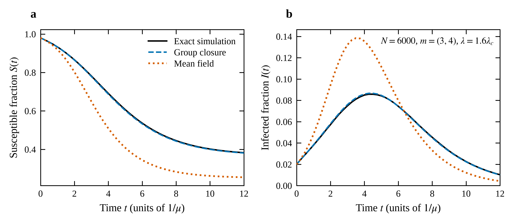
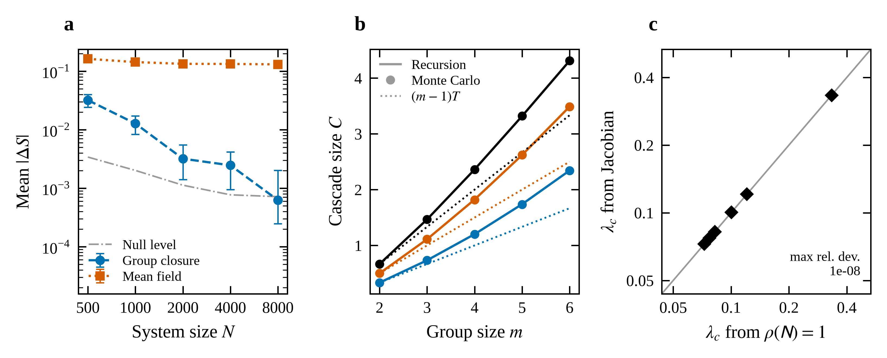

# 群体闭合的数值验证

本文档由 `tools/write_report.py` 从 `data/verification.json` 生成，与图 1、图 2 读取
同一份数据，故正文数字与图中数字不会失配。全部计算的脚本见 `tools/`。

主构型取两层、群体基数 $m=(3,4)$、联合层度分布 $P(\mathbf{k})$ 在 $(2,2)$ 与 $(3,3)$
上各占一半，渠道权重相等。由 $\rho(\mathsf{N})=1$ 得阈值 $\lambda_c=0.09931$，
含时比较取 $\lambda=1.6\lambda_c=0.15889$，初始感染比例 $\varepsilon=0.02$，$\mu=1$。

## 1. 求和规则与恒等式

方程组自带两条无需仿真的自检。其一为求和规则：对主方程逐态求和，外部风险项、群内传染项
与康复项应各自守恒相消，只余 $\dot\Phi_a=-\beta_a\Phi^A_a$。其二为全体成员易感的恒等式
$x^{(a)}_{m_a-1,0,0}=[(1-\varepsilon)\psi_a(\boldsymbol{\Phi})]^{m_a-1}$。

| 积分步长 $\mathrm{d}t$ | 恒等式残差 | 求和规则残差 |
|---|---|---|
| 0.0200 | 1.29e-10 | 1.7e-20 |
| 0.0100 | 8.00e-12 | 3.4e-21 |
| 0.0050 | 4.98e-13 | 1.0e-20 |
| 0.0025 | 3.10e-14 | 6.8e-21 |

求和规则的残差处于机器精度（$10^{-20}$ 量级），说明它是方程组的代数恒等式而非近似。
恒等式的残差随步长减小按 $\mathrm{d}t^4$ 收敛，相邻比值为 $16.1$、$16.1$、$16.0$，与四阶 Runge–Kutta 的阶一致；
这说明该恒等式同样是方程组的严格推论，观察到的残差纯属积分误差。

## 2. 主方程的数值 Jacobian 与 $\rho(\mathsf{N})=1$

阈值由两条不共享代码的路径分别求出：其一将主方程在无病定态作数值 Jacobian，对最大实部
特征值二分；其二直接解 $\rho(\mathsf{N})=1$。前者只用到方程组，后者只用到群体层面的
分支计数。

| 构型 | Jacobian 路径 | $\rho(\mathsf{N})=1$ | 相对差 |
|---|---|---|---|
| uncorrelated | 0.07718177 | 0.07718177 | 1.1e-08 |
| positively correlated | 0.07264371 | 0.07264371 | 1.1e-08 |
| negatively correlated | 0.08230844 | 0.08230844 | 1.2e-08 |
| asymmetric rates and sizes | 0.10052782 | 0.10052783 | 1.0e-08 |
| pairwise limit | 0.33333333 | 0.33333333 | 0.0e+00 |
| three layers | 0.12089080 | 0.12089080 | 4.4e-09 |

六组构型的相对差均不超过 $1e-08$，为数值 Jacobian 的有限差分精度。其中成对退化情形
的解析阈值为 $\lambda_c=1/3$，两条路径与之皆符。若在 $\mathsf{N}$ 中以 $(m-1)T$ 取代
群内级联 $C$，该一致性立即消失——级联项正是由此被发现。

## 3. 群内级联 $C$ 的递推与蒙特卡洛

$C(m,\lambda,\theta)$ 由一个小型连续时间 Markov 链的递推给出。作为独立复核，直接对孤立
群体的传播过程做蒙特卡洛抽样，每组 $4\times10^5$ 次实现。

| $m$ | $\lambda$ | 递推 | 蒙特卡洛 | 偏差 | $(m-1)T$ | 级联增益 |
|---|---|---|---|---|---|---|
| 2 | 0.5 | 0.33333 | 0.33287 ± 0.00075 | 4.6e-04 | 0.33333 | 1.000 |
| 3 | 0.5 | 0.73333 | 0.73484 ± 0.00129 | 1.5e-03 | 0.66667 | 1.100 |
| 4 | 0.5 | 1.20190 | 1.20182 ± 0.00185 | 9.0e-05 | 1.00000 | 1.202 |
| 5 | 0.5 | 1.73905 | 1.73628 ± 0.00243 | 2.8e-03 | 1.33333 | 1.304 |
| 6 | 0.5 | 2.34298 | 2.34369 ± 0.00302 | 7.1e-04 | 1.66667 | 1.406 |
| 2 | 1.0 | 0.50000 | 0.49932 ± 0.00079 | 6.8e-04 | 0.50000 | 1.000 |
| 3 | 1.0 | 1.11111 | 1.11299 ± 0.00138 | 1.9e-03 | 1.00000 | 1.111 |
| 4 | 1.0 | 1.82292 | 1.81800 ± 0.00196 | 4.9e-03 | 1.50000 | 1.215 |
| 5 | 1.0 | 2.62093 | 2.62199 ± 0.00252 | 1.1e-03 | 2.00000 | 1.310 |
| 6 | 1.0 | 3.48901 | 3.48714 ± 0.00303 | 1.9e-03 | 2.50000 | 1.396 |
| 2 | 2.0 | 0.66667 | 0.66619 ± 0.00075 | 4.8e-04 | 0.66667 | 1.000 |
| 3 | 2.0 | 1.46667 | 1.46905 ± 0.00127 | 2.4e-03 | 1.33333 | 1.100 |
| 4 | 2.0 | 2.36190 | 2.35838 ± 0.00174 | 3.5e-03 | 2.00000 | 1.181 |
| 5 | 2.0 | 3.31852 | 3.32215 ± 0.00212 | 3.6e-03 | 2.66667 | 1.244 |
| 6 | 2.0 | 4.31073 | 4.31111 ± 0.00245 | 3.8e-04 | 3.33333 | 1.293 |

两者在全部参数上一致，偏差均在蒙特卡洛的两倍标准误以内。末列给出级联相对于朴素计数
$(m-1)T$ 的增益：$m=2$ 时为 1，级联消失；群体越大增益越高，说明成员互相传染对激活时长
的延长不是可忽略的修正。

## 4. 与精确仿真的含时比较

图 1 给出 $N=6000$、400 次独立实现下的完整时间演化。
群体闭合与仿真在 $S(t)$ 与 $I(t)$ 上的最大偏差分别为 $0.0039$ 与 $0.0011$；
度均场的对应值为 $0.1983$ 与 $0.0581$，相差约 51 倍与 55 倍。
感染峰值方面，仿真为 $0.0858$（$t=4.25$），闭合为 $0.0866$（$t=4.50$），
均场为 $0.1385$（$t=3.50$）——均场把峰高抬高 1.61 倍并把峰位提前 0.75 个时间单位。

{width=5.5}

## 5. 误差随系统规模的标度

图 2(a) 给出两种闭合的偏差随 $N$ 的变化。统计量为 $\overline{|\Delta S|}$，即各时刻
仿真均值与理论之差的绝对值在时间网格上的平均。其不确定度由**对实现的自举**给出
（每个 $N$ 重采样整条轨迹 2000 次）：逐点偏差在时间上的 lag-1 自相关约 $0.95$，
网格点远非独立，重采样整条轨迹可自动保留这一相关结构，无须对它作任何假设。

零假设的参照不是 $0$ 而是**噪声水平**。$\overline{|\Delta S|}$ 是绝对值的平均，恒为正，
其置信区间永不包含 $0$；真实偏差为零时它的期望等于各时刻抽样标准误的平均乘以
$\sqrt{2/\pi}$，这才是应当比较的基准。

| $N$ | 实现次数 | 群体闭合 [95% CI] | 度均场 [95% CI] | 零假设水平 |
|---|---|---|---|---|
| 500 | 600 | 0.03198 [0.02432, 0.03999] | 0.16243 [0.15471, 0.17045] | 0.00341 |
| 1000 | 600 | 0.01274 [0.00830, 0.01727] | 0.14313 [0.13836, 0.14770] | 0.00201 |
| 2000 | 800 | 0.00319 [0.00141, 0.00552] | 0.13351 [0.13108, 0.13598] | 0.00113 |
| 4000 | 800 | 0.00246 [0.00095, 0.00416] | 0.13292 [0.13129, 0.13462] | 0.00077 |
| 8000 | 500 | 0.00063 [0.00025, 0.00202] | 0.13087 [0.12930, 0.13244] | 0.00072 |

群体闭合的偏差由 $N=500$ 处高出零假设水平 $9.4$ 倍，单调降至 $N=8000$ 处的 $0.00063$，
已低于该水平（$0.00072$），即与「偏差为零」完全相容。只取高于零假设水平的 $4$ 个点作
加权幂律拟合，指数为 $-1.36\pm0.16$。
须说明两点：其一，各测量值都含噪声贡献因而是真实偏差的上界，真实衰减只会更陡；
其二，该指数比朴素预期的 $-1$（位形模型中短回路密度的量级）陡约 $2.3\sigma$，
不宜简单声称「与 $O(1/N)$ 一致」。

度均场的偏差则只由 $0.16243$ 降到 $0.13087$，按 $a+b/N$ 外推得平台
$a=0.12869\pm0.00073$，即 $176\sigma$ 地不为零；在最大规模处它仍是零假设水平的 $182$ 倍、
闭合的 $209$ 倍。两者因而不是同一类误差：闭合的可以靠增大系统消除，均场的不能，
因为那是闭合层级的误差。

{width=5.5}

## 结论

五项验证全部通过。方程组自洽（§1），阈值公式经两条独立路径互证（§2），群内级联量经
蒙特卡洛复核（§3），闭合能复现完整的含时演化（§4），且其误差随系统规模趋零而度均场
的误差收敛到非零平台（§5）。第 2 节的理论至此具备可用于后续结构扫描的可信度。
